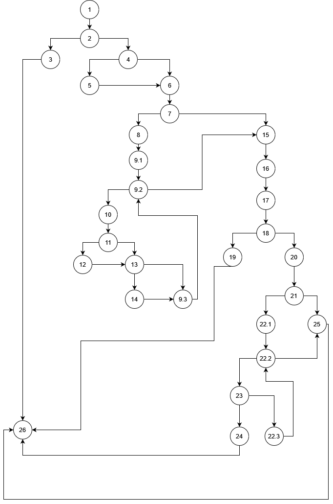

# Pavel Paunovski 216049

## 2. CFG slika

## 3. Цикломатската комплексност

Цикломатска комплексност преку број на региони е 11. Кога ќе се избројат
сите региони, вклучувајќи го и надворешниот има 11.

Според број на гранки минус број на јазли плус 2:
39 - 30 + 2 = 11

## 4. Every Branch Criteria

| Branch / Test | User=null, allUsers=any | User = User(username=null, password=password*, email=email@email.com), allUsers = {user1=User(username=pavel, password=password!, email=email@email.com), user2=User(username=email@email.com,password=password!, email=test@test.com)} | User=User(Username=username, Password=username123, Email=emailemail.com), allUsers=any | User=User(username=username, password=pass word*, email=email@emailcom), allUsers=any | User=User(Username=username, password=password, Email=email), allUsers=any |
|---------------|-------------------------|-----------------------------------------------------------------------------------------------------------------------------------------------------------------------------------------------------------------------------------------|----------------------------------------------------------------------------------------|---------------------------------------------------------------------------------------|----------------------------------------------------------------------------|
| 1-2           | *                       | *                                                                                                                                                                                                                                       | *                                                                                      | *                                                                                     | *                                                                          |
| 2-3           | *                       |                                                                                                                                                                                                                                         |                                                                                        |                                                                                       |                                                                            |
| 2-4           |                         | *                                                                                                                                                                                                                                       | *                                                                                      | *                                                                                     | *                                                                          |
| 3-26          | *                       |                                                                                                                                                                                                                                         |                                                                                        |                                                                                       |                                                                            |
| 4-5           |                         | *                                                                                                                                                                                                                                       |                                                                                        |                                                                                       |                                                                            |
| 4-6           |                         |                                                                                                                                                                                                                                         | *                                                                                      | *                                                                                     | *                                                                          |
| 5-6           |                         | *                                                                                                                                                                                                                                       |                                                                                        |                                                                                       |                                                                            |
| 6-7           |                         | *                                                                                                                                                                                                                                       | *                                                                                      | *                                                                                     | *                                                                          |
| 7-8           |                         | *                                                                                                                                                                                                                                       |                                                                                        |                                                                                       |                                                                            |
| 7-15          |                         |                                                                                                                                                                                                                                         | *                                                                                      | *                                                                                     | *                                                                          |
| 8-9.1         |                         | *                                                                                                                                                                                                                                       |                                                                                        |                                                                                       |                                                                            |
| 9.1-9.2       |                         | *                                                                                                                                                                                                                                       |                                                                                        |                                                                                       |                                                                            |
| 9.2-10        |                         | *                                                                                                                                                                                                                                       |                                                                                        |                                                                                       |                                                                            |
| 9.2-15        |                         | *                                                                                                                                                                                                                                       |                                                                                        |                                                                                       |                                                                            |
| 10-11         |                         | *                                                                                                                                                                                                                                       |                                                                                        |                                                                                       |                                                                            |
| 11-12         |                         | *                                                                                                                                                                                                                                       |                                                                                        |                                                                                       |                                                                            |
| 11-13         |                         | *                                                                                                                                                                                                                                       |                                                                                        |                                                                                       |                                                                            |
| 12-13         |                         | *                                                                                                                                                                                                                                       |                                                                                        |                                                                                       |                                                                            |
| 13-14         |                         | *                                                                                                                                                                                                                                       |                                                                                        |                                                                                       |                                                                            |
| 13-9.3        |                         | *                                                                                                                                                                                                                                       |                                                                                        |                                                                                       |                                                                            |
| 14-9.3        |                         | *                                                                                                                                                                                                                                       |                                                                                        |                                                                                       |                                                                            |
| 9.3-9.2       |                         | *                                                                                                                                                                                                                                       |                                                                                        |                                                                                       |                                                                            |
| 15-16         |                         | *                                                                                                                                                                                                                                       | *                                                                                      | *                                                                                     | *                                                                          |
| 16-17         |                         | *                                                                                                                                                                                                                                       | *                                                                                      | *                                                                                     | *                                                                          |
| 17-18         |                         | *                                                                                                                                                                                                                                       | *                                                                                      | *                                                                                     | *                                                                          |
| 18-19         |                         |                                                                                                                                                                                                                                         | *                                                                                      |                                                                                       |                                                                            |
| 18-20         |                         | *                                                                                                                                                                                                                                       |                                                                                        | *                                                                                     | *                                                                          |
| 19-26         |                         |                                                                                                                                                                                                                                         | *                                                                                      |                                                                                       |                                                                            |
| 20-21         |                         | *                                                                                                                                                                                                                                       |                                                                                        | *                                                                                     | *                                                                          |
| 21-22.1       |                         | *                                                                                                                                                                                                                                       |                                                                                        |                                                                                       | *                                                                          |
| 21-25         |                         |                                                                                                                                                                                                                                         |                                                                                        | *                                                                                     |                                                                            |
| 22.1-22.2     |                         | *                                                                                                                                                                                                                                       |                                                                                        |                                                                                       | *                                                                          |
| 22.2-23       |                         | *                                                                                                                                                                                                                                       |                                                                                        |                                                                                       | *                                                                          |
| 22.2-25       |                         |                                                                                                                                                                                                                                         |                                                                                        |                                                                                       | *                                                                          |
| 23-24         |                         | *                                                                                                                                                                                                                                       |                                                                                        |                                                                                       |                                                                            |
| 23-22.3       |                         | *                                                                                                                                                                                                                                       |                                                                                        |                                                                                       | *                                                                          |
| 24-26         |                         | *                                                                                                                                                                                                                                       |                                                                                        |                                                                                       |                                                                            |
| 22.3-22.2     |                         | *                                                                                                                                                                                                                                       |                                                                                        |                                                                                       | *                                                                          |
| 25-26         |                         |                                                                                                                                                                                                                                         |                                                                                        | *                                                                                     | *                                                                          |

### Тест 1.
#### User=null, allUsers=any
Доколку user е null тогаш ќе се влезе во делот со exception и ќе заврши така програмата.
allUsers може да има било каква вредност исходот ќе биде ист.
Ќе се поминат гранките:
1-2, 2-3, 3-26

### Тест 2.
#### User = User(username=null, password=password*, email=email@email.com), allUsers = {user1=User(username=pavel, password=password!, email=email@email.com), user2=User(username=email@email.com,password=password!, email=test@test.com)}

Овде username на user е null па затоа ја поминува гранката 2-4 и го сетира username-от како што е и email-от на user (username = email@email.com).
allUsers има два елементи, user1 кој има различен username од user и ист email со user, и user2 кој има ист username а различен email од user.
Со овие два елементи се поминува целосно for циклусот.

За user1 ќе се изминат гранките: 11-12, 12-13, 13-9.3
За user2 ќе се изминат гранките: 11-13, 13-14, 14-9.3

Потоа бидејќи password-от е валиден се изминува и следниот for циклус, а бидејќи специјалниот карактер
не е првиот (односно не е !) ќе се изминат гранките 23-22.3, 23-24, 24-26

### Тест 3.
#### User=User(Username=username, Password=username123, Email=emailemail.com), allUsers=any

Со овој тест сакам да ја иминам гранката 18-19 а потоа и 19-26 односно да имам password во кој се содржи username-от.
allUsers го ставам на било пто поради тоа што не е важно за овој случај.
email-от на user е невалиден за да се измине гранката 7-15.

### Тест 4.
#### User=User(username=username, password=pass word*, email=email@emailcom), allUsers=any

allUsers е повторно any бидејќи не е важно за овој тест.
Овде сакам да се измине гранката 21-25 а потоа и 25-26.
Поради тоа password-от на user има " " (празно место).
email-от на user е невалиден (не содржи карактер .) со цел да се скрати во чекорите на тестот бидејќи тој дел од кодот е изминат веќе со друг тест.

### Тест 5.
#### User=User(Username=username, password=password, Email=email), allUsers=any

allUsers е повторно any бидејќи не е важно за овој тест.
Овде сакам да се измине гранката 22.2-25, тоа се постигнува со тоа што user има валиден password но нема специјален крактер,
па ќе се измине целиот for loop и на крај кога нема да се најде специјален карактер ќе се измине гранката 22.2-25.
email-от е повторно невалиден од истата причина

## 5. Multiple Condition Criteria 
###  _if (user==null || user.getPassword()==null || user.getEmail()==null)_

| Test                                                                       | user == null | user.getPassword() == null | user.getEmail() == null |
|----------------------------------------------------------------------------|--------------|----------------------------|-------------------------|
| User = null, allUsers = any                                                | T            | any                        | any                     |
| User = User(username=any, password=null, email=any), allUsers=any          | F            | T                          | any                     |
| User = User(username=any, password=password, email = null), allUsers = any | F            | F                          | T                       |
| User = User(username=any, password=password, email=email@email.com)        | F            | F                          | F                       |

